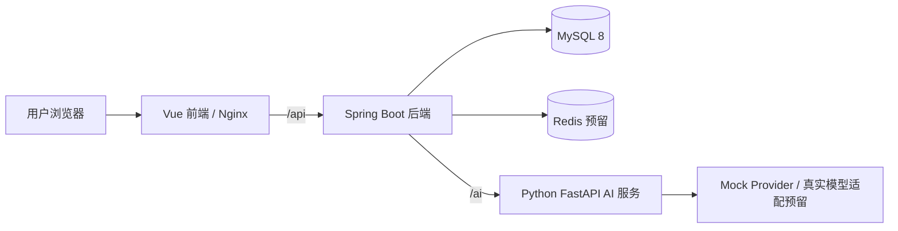

# 智学工坊 EduAgent Studio

EduAgent Studio 是面向“中国软件杯 A3 赛题”的个性化资源生成与学习多智能体系统。项目实现名称为 **EduAgent Studio**，前期 URD/SRS 文档中使用的 **LearnAgent-A3** 为同一项目的赛题阶段名称。正式提交时建议统一命名为“智学工坊 EduAgent Studio”。

## 项目背景

高校学生在复习、备考和课程实践中通常面临资料分散、学习目标不清晰、复习路径缺少反馈、生成式 AI 难以沉淀为结构化学习资产等问题。本项目围绕“Java 软件开发 + MySQL 数据库设计 + AI 微服务”构建可运行、可演示、可部署的学习助手系统，通过 Mock AI 默认模式保证无真实 API Key 时仍可完成完整演示。

## 系统功能

- 账号认证：注册、登录、JWT 鉴权、演示账号。
- 学习空间：按用户组织学习主题、资源、任务和报告。
- AI 模型配置：支持 Mock 模型，预留 OpenAI Compatible、DeepSeek、Qwen、Ollama 等扩展。
- 智能对话：基于学习空间和模型配置生成学习建议。
- 多智能体任务：规划、知识梳理、资源生成、练习生成、复盘评估。
- 知识库：文件元数据、分块、检索、问答和知识图谱展示。
- 资源生成：复习计划、讲义、练习、知识图谱等结构化资源。
- 学习路径：生成阶段化学习任务并跟踪进度。
- 测验闭环：生成测验、提交答案、掌握度分析。
- 学习报告：概览指标、空间报告、AI 总结和建议。

## 技术栈

- 前端：Vue 3、TypeScript、Vite、Element Plus、Pinia、Vue Router、Axios、ECharts、Markdown、Mermaid。
- 后端：Java 21、Spring Boot 3、Spring Security、JWT、MyBatis-Plus、Validation、Knife4j/OpenAPI。
- AI 服务：Python、FastAPI、Pydantic、Mock Provider、多智能体模块。
- 数据库：MySQL 8、逻辑外键、逻辑删除、规范化表设计。
- 基础设施：Docker Compose、Nginx、Redis 预留缓存。

## 架构图



## 目录结构

```text
PLAM_Codex/
  backend/                 Java Spring Boot 主后端
  frontend/                Vue 3 前端
  ai-service/              Python FastAPI AI 微服务
  docs/                    项目、数据库、后端、前端、测试、部署、提交文档
  scripts/                 启动、停止、初始化、Smoke Test 脚本
  docker-compose.yml       一键部署编排
  .env.example             环境变量模板
  SRS.md / URD.md          前期赛题需求文档
```

## 快速启动

本地开发推荐分别启动 MySQL、AI 服务、后端和前端；最终演示推荐使用 Docker Compose。

演示账号：

| 用户名 | 明文密码 | 角色 |
| --- | --- | --- |
| demo_admin | 123456 | 管理员 |
| demo_teacher | 123456 | 教师 |
| demo_student | 123456 | 学生 |

## 本地开发启动

1. 初始化 MySQL 8：

```powershell
mysql -uroot -p < backend/src/main/resources/sql/schema.sql
mysql -uroot -p eduagent_studio < backend/src/main/resources/sql/seed.sql
```

2. 启动 Python AI 服务：

```powershell
cd ai-service
python -m uvicorn app.main:app --host 127.0.0.1 --port 8000
```

3. 启动 Java 后端：

```powershell
cd backend
mvn.cmd spring-boot:run
```

4. 启动 Vue 前端：

```powershell
cd frontend
npm.cmd install --cache .\.npm-cache
npm.cmd run dev
```

访问地址：

- 前端：http://127.0.0.1:5173
- 后端健康检查：http://127.0.0.1:8080/api/health
- Knife4j：http://127.0.0.1:8080/doc.html
- OpenAPI：http://127.0.0.1:8080/v3/api-docs
- AI 服务健康检查：http://127.0.0.1:8000/ai/health
- AI 服务文档：http://127.0.0.1:8000/docs

## Docker Compose 启动

```powershell
Copy-Item .env.example .env
.\scripts\start.ps1 -Build
```

或直接执行：

```powershell
docker compose up -d --build
```

停止：

```powershell
.\scripts\stop.ps1
```

Docker Compose 包含 MySQL、Redis、AI 服务、Java 后端和前端 Nginx。MySQL 首次启动时会自动执行 `schema.sql` 和 `seed.sql`。

## Mock AI 模式

默认 `AI_SERVICE_MOCK_MODE=true`，系统不需要真实 API Key 即可完成模型测试、对话、资源生成、学习路径、测验和报告演示。数据库演示模型配置使用 `provider_type=mock`，不会保存明文 API Key。

## 自定义 AI 模型 API

后续可在“模型配置”页面新增 OpenAI Compatible、DeepSeek、Qwen、Ollama 或 Custom 类型配置。真实 API Key 应由后端加密保存，提交与演示环境不得写入明文密钥。

## 数据库初始化说明

- 结构脚本：`backend/src/main/resources/sql/schema.sql`
- 演示数据：`backend/src/main/resources/sql/seed.sql`
- 设计文档：`docs/database/schema.md`

数据库采用“逻辑外键为主、数据库强外键为辅”的策略，便于 MyBatis-Plus、逻辑删除和演示数据重置。

## 前端页面说明

前端包含首页、登录、注册、仪表盘、学习空间、用户中心、模型配置、AI 对话、智能体工作台、知识库、资源生成、知识图谱、学习路径、测验、报告和帮助页。前端只通过 `/api/**` 调用 Java 后端，不直接访问 Python AI 服务。

## 测试与自检

```powershell
cd ai-service
python -m pytest

cd ..\backend
mvn.cmd test
mvn.cmd clean package

cd ..\frontend
npm.cmd run build

cd ..
.\scripts\smoke-test.ps1
docker compose config
```

Smoke Test 文档见 `docs/testing/smoke-test.md`。

## 常见问题

- Docker 不可用：先使用本地开发启动方式，Docker 留到部署环境验证。
- MySQL 端口冲突：修改 `.env` 中的 `MYSQL_PORT`。
- 前端登录 401：确认后端已启动、数据库已导入 `seed.sql`、演示账号存在。
- AI 调用失败：确认 `AI_SERVICE_BASE_URL` 本地为 `http://localhost:8000`，Docker 中为 `http://ai-service:8000`。
- Redis 未实际使用：Redis 当前为预留依赖，不应阻塞主流程演示。

## 软件杯提交说明

建议提交源代码、README、数据库脚本、部署脚本、API 文档、数据库设计文档、测试文档、演示视频脚本、答辩 PPT 大纲和项目报告大纲。提交清单见 `docs/submit/checklist.md`。

## 实习答辩说明

答辩重点建议围绕 Java 后端模块化设计、MySQL 规范化设计、逻辑外键策略、Mock AI 保底演示、多智能体链路、前后端工程化和 Docker 一键部署展开。最终总结见 `docs/project/final-summary.md`。
