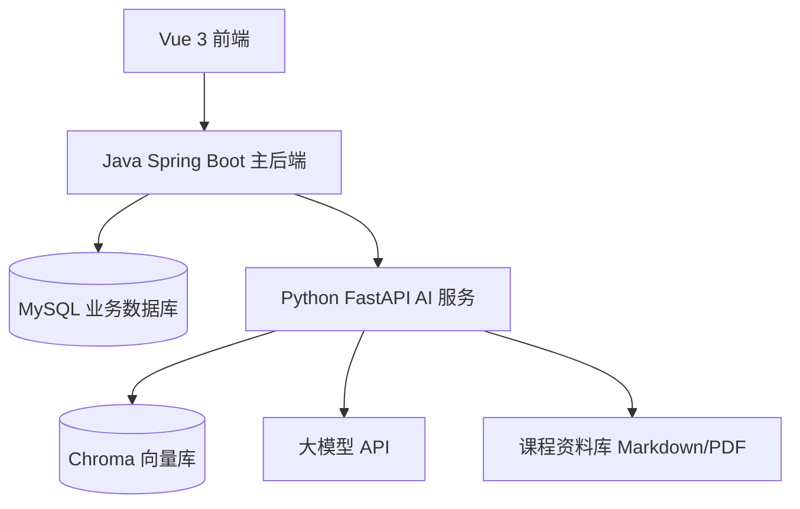
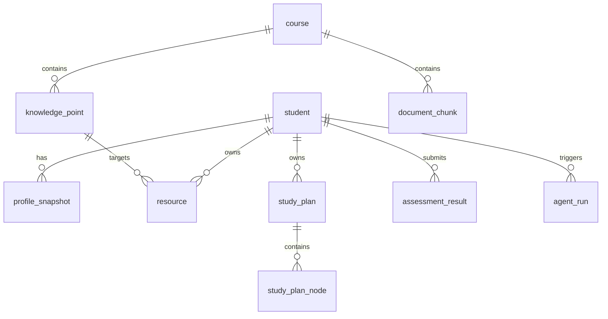

# LearnAgent-A3 软件需求规格说明书（SRS）

Software Requirements Specification

项目中文名：基于大模型的个性化资源生成与学习多智能体系统开发  
项目英文名：LearnAgent: An LLM-Powered Personalized Learning Resource Generation and Multi-Agent System  
版本：v1.0  
日期：2026-06-01  
适用阶段：Java 软件开发与数据库联合实习 / 中国软件杯 A3 赛题初赛准备  
推荐技术路线：Vue 3 + Java Spring Boot + MySQL + Python FastAPI + Chroma + 大模型 API

---

## 1. 引言

### 1.1 编写目的

本文档定义 LearnAgent-A3 系统的软件需求规格，用于指导系统设计、开发、测试、部署和验收。本文档在 URD 的基础上，将用户需求进一步转化为可实现、可测试、可追踪的软件需求。

本文档重点说明：

1. 系统总体架构。
2. 功能需求。
3. 接口需求。
4. 数据库需求。
5. AI 服务需求。
6. 非功能性需求。
7. 验收标准。

### 1.2 读者对象

1. 前端开发人员。
2. Java 后端开发人员。
3. Python AI 服务开发人员。
4. 数据库设计人员。
5. 测试人员。
6. 指导教师和评审人员。

### 1.3 项目定位

LearnAgent-A3 是一个面向高校课程学习场景的个性化学习资源生成系统。系统通过学生画像、课程知识库、RAG 检索、多智能体协作和大模型生成能力，为学生提供个性化学习资源、学习路径、智能辅导和学习效果评估。

本系统采用双后端架构：

1. Java Spring Boot 作为业务主后端。
2. Python FastAPI 作为 AI 能力服务。
3. Vue 3 作为前端展示与交互层。
4. MySQL 作为业务数据库。
5. Chroma 作为课程知识库向量检索组件。

---

## 2. 总体描述

### 2.1 系统目标

系统应实现以下目标：

| 编号 | 目标 |
|---|---|
| SG-01 | 支持学生通过自然语言构建学习画像 |
| SG-02 | 支持基于画像和课程知识库生成个性化学习资源 |
| SG-03 | 支持多智能体协作，并保存运行轨迹 |
| SG-04 | 支持学习路径生成与展示 |
| SG-05 | 支持智能辅导和课程知识库问答 |
| SG-06 | 支持练习提交、评分和学习效果评估 |
| SG-07 | 支持 Java 后端和 MySQL 数据库持久化 |
| SG-08 | 支持 Python AI 服务与 Java 主后端集成 |

### 2.2 系统架构



### 2.3 双后端顺序图


### 2.4 技术栈

| 层级 | 技术 | 用途 |
|---|---|---|
| 前端 | Vue 3 | 构建用户界面 |
| 前端构建 | Vite | 前端开发、热更新和打包 |
| UI 组件 | Element Plus | 表单、表格、卡片、弹窗等界面组件 |
| 前端请求 | Axios | 调用 Java 后端接口 |
| 前端路由 | Vue Router | 管理画像、资源、路径、辅导等页面 |
| 状态管理 | Pinia | 管理当前学生、画像、资源等状态 |
| Java 后端 | Spring Boot | 业务主服务 |
| ORM | MyBatis-Plus 或 JPA | Java 对象与 MySQL 表映射 |
| 数据库 | MySQL | 存储业务数据 |
| AI 服务 | Python FastAPI | 提供大模型、RAG、多智能体能力 |
| 向量库 | Chroma | 课程资料语义检索 |
| 大模型 | MiMo / 讯飞星火 / 其他模型 API | 画像抽取、资源生成、路径规划、答疑 |
| 图表 | Mermaid | 思维导图、流程图、顺序图 |
| 部署 | Docker Compose 可选 | 一键启动多个服务 |

### 2.5 设计约束

| 编号 | 约束 |
|---|---|
| C-01 | 前端只能调用 Java Spring Boot，不直接调用 Python AI 服务 |
| C-02 | 业务数据由 Java 后端统一写入 MySQL |
| C-03 | Python AI 服务返回结构化 JSON，字段需稳定 |
| C-04 | 大模型 API Key 不得出现在前端代码和 Git 仓库 |
| C-05 | 课程问答和资源生成应尽量基于课程知识库 |
| C-06 | 演示环境必须支持本地运行 |

---

## 3. 外部接口需求

### 3.1 用户界面

系统前端应至少包含以下页面：

| 页面 | 路由 | 说明 |
|---|---|---|
| 首页仪表盘 | `/dashboard` | 展示当前学生、学习目标、进度和推荐入口 |
| 画像构建页 | `/profile` | 通过自然语言输入生成学习画像 |
| 资源生成页 | `/resources` | 选择知识点并生成学习资源 |
| 学习路径页 | `/study-plan` | 展示学习路径和节点状态 |
| 智能辅导页 | `/tutor` | 提供课程问答和学习辅导 |
| 评估分析页 | `/analytics` | 展示练习结果、掌握度和薄弱点 |
| Agent 轨迹页 | `/agent-runs` | 展示多智能体运行记录 |

### 3.2 Java 后端接口

Java 后端提供 `/api/*` 业务接口，前端仅调用这些接口。

| 方法 | 路径 | 功能 |
|---|---|---|
| GET | `/api/health` | Java 服务健康检查 |
| POST | `/api/profile/extract` | 生成学生画像 |
| GET | `/api/profile/{studentId}` | 查询学生最新画像 |
| GET | `/api/profile/{studentId}/history` | 查询画像历史 |
| POST | `/api/resources/generate` | 生成个性化资源 |
| GET | `/api/resources/{studentId}` | 查询学生资源列表 |
| GET | `/api/resources/detail/{resourceId}` | 查询资源详情 |
| POST | `/api/study-plan/generate` | 生成学习路径 |
| GET | `/api/study-plan/{studentId}` | 查询学习路径 |
| POST | `/api/tutor/ask` | 智能辅导提问 |
| POST | `/api/assessment/submit` | 提交练习结果 |
| GET | `/api/analytics/{studentId}` | 查询学习评估数据 |
| GET | `/api/agent-runs/{taskId}` | 查询 Agent 运行轨迹 |

### 3.3 Python AI 服务接口

Python AI 服务提供 `/ai/*` 内部接口，只允许 Java 后端调用。

| 方法 | 路径 | 功能 |
|---|---|---|
| GET | `/ai/health` | AI 服务健康检查 |
| POST | `/ai/profile/extract` | 从学生描述抽取画像 |
| POST | `/ai/resources/generate` | 生成个性化资源 |
| POST | `/ai/study-plan/generate` | 生成学习路径 |
| POST | `/ai/tutor/ask` | 基于 RAG 的智能辅导 |
| POST | `/ai/assessment/analyze` | 分析练习结果和薄弱点 |
| POST | `/ai/course/ingest` | 课程资料入库 |
| POST | `/ai/critic/review` | 审查 AI 生成内容 |

---

## 4. 功能需求

### 4.1 学生画像模块

#### FR-01 画像抽取

系统应允许学生输入自然语言描述，并由 AI 服务抽取结构化画像。

输入示例：

```json
{
  "studentId": 1,
  "courseId": 1,
  "studentMessage": "我是计算机大二学生，想两周内学会 A* 搜索算法。我 Python 一般，喜欢图解和代码例子。"
}
```

输出字段应包含：

| 字段 | 说明 |
|---|---|
| major | 专业 |
| grade | 年级 |
| course | 课程 |
| goal | 学习目标 |
| foundation | 基础水平 |
| weakness | 薄弱点 |
| preference | 学习偏好 |
| timeBudget | 可用时间 |
| masteryMap | 知识点掌握度 |

验收标准：

1. 学生输入描述后，系统能返回画像 JSON。
2. 画像维度不少于 6 个。
3. Java 后端能将画像保存到 `profile_snapshot` 表。

#### FR-02 画像查看

系统应支持查看学生最新画像和画像历史版本。

#### FR-03 画像更新

系统应根据练习结果、学习反馈和智能辅导记录更新画像。

### 4.2 课程知识库模块

#### FR-04 课程资料维护

系统应支持至少一门课程资料，建议课程为《人工智能导论》。

课程资料应包含：

1. 课程大纲。
2. 章节内容。
3. 知识点列表。
4. 常见误区。
5. 练习题。
6. 代码案例。

#### FR-05 文档切片和检索

Python AI 服务应支持将课程资料切分为文档片段，并写入 Chroma 向量库。

每个文档片段应包含：

1. `chunkId`
2. `courseId`
3. `knowledgePointId`
4. `sourceFile`
5. `content`
6. `embeddingStatus`

### 4.3 个性化资源生成模块

#### FR-06 资源生成

系统应支持根据学生画像、课程知识点和课程知识库生成个性化资源。

必须支持至少 5 类资源：

| 类型 | 说明 |
|---|---|
| explanation_doc | 个性化讲义 |
| mindmap | 思维导图 |
| quiz | 分层练习题 |
| reading_material | 拓展阅读 |
| code_lab | 代码实操案例 |

可选支持：

| 类型 | 说明 |
|---|---|
| micro_lesson | 微课脚本和分镜 |
| project_task | 实践项目任务 |

#### FR-07 资源保存

Java 后端应将 AI 服务返回的资源保存到 `resource` 表。

#### FR-08 资源审查

AI 服务应提供 Critic Agent 对生成资源进行审查，输出质量分、问题和修改建议。

### 4.4 多智能体模块

#### FR-09 Agent 分工

系统应至少包含以下 Agent：

| Agent | 职责 |
|---|---|
| Profile Agent | 画像抽取与更新 |
| Retriever Agent | 课程知识库检索 |
| Planner Agent | 资源生成计划 |
| Resource Agent | 学习资源生成 |
| Quiz Agent | 练习题生成 |
| Code Agent | 代码实操案例生成 |
| Critic Agent | 质量审查 |
| Path Agent | 学习路径规划 |

#### FR-10 Agent 轨迹保存

每次 AI 任务执行时，Java 后端应保存 Agent 运行记录到 `agent_run` 表。

记录内容应包含：

1. 任务 ID。
2. Agent 名称。
3. 输入摘要。
4. 输出摘要。
5. 模型名称。
6. 状态。
7. 耗时。
8. 错误信息。

### 4.5 学习路径模块

#### FR-11 学习路径生成

系统应基于学生画像、知识点依赖、资源列表和练习结果生成学习路径。

路径节点应包含：

1. 学习顺序。
2. 知识点。
3. 推荐资源。
4. 预计时长。
5. 推荐理由。
6. 完成条件。

#### FR-12 路径保存和展示

Java 后端应将路径主表保存到 `study_plan`，将路径节点保存到 `study_plan_node`。

### 4.6 智能辅导模块

#### FR-13 学习问答

系统应允许学生输入课程问题，Java 后端调用 Python AI 服务生成回答。

回答应包含：

1. 直接回答。
2. 解释或例子。
3. 引用来源。
4. 推荐下一步资源。

#### FR-14 防幻觉提示

当课程知识库检索结果不足时，系统应提示“课程依据不足，建议教师确认”。

### 4.7 学习评估模块

#### FR-15 练习提交

系统应允许学生提交练习答案。

#### FR-16 自动评分

系统应对客观题进行自动评分，对主观题可调用 AI 服务进行辅助分析。

#### FR-17 掌握度更新

系统应根据练习结果更新知识点掌握度。

掌握度范围：

```text
0.00 表示完全未掌握
1.00 表示完全掌握
```

### 4.8 管理与演示模块

#### FR-18 课程数据管理

管理员应能维护课程、知识点和课程资料。

#### FR-19 演示数据

系统应预置 Demo 学生、Demo 课程和 Demo 资源，保证演示稳定。

---

## 5. 数据需求

### 5.1 核心数据表

| 表名 | 说明 |
|---|---|
| `student` | 学生基础信息 |
| `course` | 课程信息 |
| `knowledge_point` | 知识点 |
| `profile_snapshot` | 学生画像快照 |
| `resource` | 生成资源 |
| `study_plan` | 学习路径主表 |
| `study_plan_node` | 学习路径节点 |
| `assessment_result` | 练习评估结果 |
| `agent_run` | Agent 运行记录 |
| `document_chunk` | 文档切片元数据 |

### 5.2 表结构概要

#### student

| 字段 | 类型 | 说明 |
|---|---|---|
| id | BIGINT | 主键 |
| name | VARCHAR(64) | 学生姓名 |
| major | VARCHAR(128) | 专业 |
| grade | VARCHAR(32) | 年级 |
| created_at | DATETIME | 创建时间 |
| updated_at | DATETIME | 更新时间 |

#### profile_snapshot

| 字段 | 类型 | 说明 |
|---|---|---|
| id | BIGINT | 主键 |
| student_id | BIGINT | 学生 ID |
| course_id | BIGINT | 课程 ID |
| profile_json | JSON | 学生画像 |
| source | VARCHAR(32) | 来源：conversation/assessment/manual |
| created_at | DATETIME | 创建时间 |

#### resource

| 字段 | 类型 | 说明 |
|---|---|---|
| id | BIGINT | 主键 |
| student_id | BIGINT | 学生 ID |
| course_id | BIGINT | 课程 ID |
| knowledge_point_id | BIGINT | 知识点 ID |
| resource_type | VARCHAR(64) | 资源类型 |
| title | VARCHAR(255) | 标题 |
| content | LONGTEXT | 资源内容 |
| format | VARCHAR(32) | markdown/json/mermaid/code |
| quality_score | DECIMAL(4,2) | 质量分 |
| status | VARCHAR(32) | 状态 |
| created_at | DATETIME | 创建时间 |

#### agent_run

| 字段 | 类型 | 说明 |
|---|---|---|
| id | BIGINT | 主键 |
| task_id | VARCHAR(64) | 任务 ID |
| student_id | BIGINT | 学生 ID |
| agent_name | VARCHAR(64) | Agent 名称 |
| input_summary | TEXT | 输入摘要 |
| output_summary | TEXT | 输出摘要 |
| model_name | VARCHAR(64) | 模型名称 |
| status | VARCHAR(32) | success/failed |
| latency_ms | INT | 耗时 |
| error_message | TEXT | 错误信息 |
| created_at | DATETIME | 创建时间 |

### 5.3 数据关系



---

## 6. 接口详细需求

### 6.1 Java 接口：画像抽取

路径：

```text
POST /api/profile/extract
```

请求：

```json
{
  "studentId": 1,
  "courseId": 1,
  "studentMessage": "我是计算机大二学生，想两周内学会 A* 搜索算法。"
}
```

响应：

```json
{
  "taskId": "task_20260601_001",
  "profileSnapshotId": 1001,
  "profile": {
    "major": "计算机科学与技术",
    "grade": "大二",
    "goal": "两周内学会 A* 搜索算法",
    "foundation": "Python 基础一般",
    "weakness": ["搜索算法基础薄弱"],
    "preference": ["图解", "代码案例"]
  }
}
```

### 6.2 Python 接口：画像抽取

路径：

```text
POST /ai/profile/extract
```

请求：

```json
{
  "taskId": "task_20260601_001",
  "studentMessage": "我是计算机大二学生，想两周内学会 A* 搜索算法。",
  "courseContext": []
}
```

响应：

```json
{
  "profileJson": {
    "major": "计算机科学与技术",
    "grade": "大二",
    "goal": "两周内学会 A* 搜索算法",
    "foundation": "Python 基础一般",
    "weakness": ["搜索算法基础薄弱"],
    "preference": ["图解", "代码案例"]
  },
  "agentTrace": [
    {
      "agentName": "ProfileAgent",
      "status": "success",
      "outputSummary": "抽取 6 个画像维度"
    }
  ]
}
```

### 6.3 Java 接口：资源生成

路径：

```text
POST /api/resources/generate
```

请求：

```json
{
  "studentId": 1,
  "courseId": 1,
  "knowledgePointId": 12,
  "resourceTypes": ["explanation_doc", "mindmap", "quiz", "reading_material", "code_lab"]
}
```

响应：

```json
{
  "taskId": "task_resource_001",
  "resourceIds": [2001, 2002, 2003, 2004, 2005],
  "status": "success"
}
```

---

## 7. 非功能性需求

### 7.1 性能需求

| 编号 | 要求 |
|---|---|
| NFR-01 | 普通查询接口响应时间应小于 2 秒 |
| NFR-02 | 画像抽取接口应在 15 秒内返回，若超过需显示加载状态 |
| NFR-03 | 资源生成任务可能较慢，应显示任务状态或进度 |
| NFR-04 | 前端页面首次加载应小于 5 秒 |

### 7.2 可用性需求

| 编号 | 要求 |
|---|---|
| NFR-05 | 核心功能页面应有清晰入口 |
| NFR-06 | 生成失败时应显示友好提示 |
| NFR-07 | 表单输入应进行基础校验 |
| NFR-08 | 资源内容应支持 Markdown 展示 |

### 7.3 安全需求

| 编号 | 要求 |
|---|---|
| NFR-09 | 大模型 API Key 只能存放在后端环境变量中 |
| NFR-10 | 前端不得直接访问 Python AI 服务 |
| NFR-11 | 系统应过滤明显违规或作弊请求 |
| NFR-12 | 生成内容应经过基础安全审查 |

### 7.4 可维护性需求

| 编号 | 要求 |
|---|---|
| NFR-13 | Java 后端采用 Controller-Service-Mapper/Repository 分层 |
| NFR-14 | Python AI 服务按 agents、rag、llm_gateway 分层 |
| NFR-15 | 前端按 pages、components、api、stores 分层 |
| NFR-16 | 接口请求和响应 DTO 应稳定 |

### 7.5 可靠性需求

| 编号 | 要求 |
|---|---|
| NFR-17 | Python 服务不可用时，Java 应返回明确错误信息 |
| NFR-18 | 大模型调用失败时，应记录错误并支持重试或缓存结果 |
| NFR-19 | 数据库写入失败时，不应向前端返回成功状态 |

---

## 8. 系统运行环境

### 8.1 开发环境

| 项 | 建议 |
|---|---|
| 操作系统 | Windows 10/11 |
| Java | JDK 17 |
| 后端框架 | Spring Boot 3.x |
| Python | Python 3.11+ |
| 前端 | Node.js 20+ |
| 数据库 | MySQL 8.x |
| 向量库 | Chroma |
| IDE | IntelliJ IDEA / VS Code |

### 8.2 部署环境

最小部署组件：

1. Vue 前端。
2. Java Spring Boot 服务。
3. MySQL 数据库。
4. Python FastAPI 服务。
5. Chroma 本地向量库。

可选使用 Docker Compose 统一启动。

---

## 9. 业务规则

| 编号 | 规则 |
|---|---|
| BR-01 | 一个学生可以有多个画像快照 |
| BR-02 | 每次画像生成必须保存任务记录 |
| BR-03 | 每次资源生成至少应产生 5 类资源 |
| BR-04 | 每个资源应关联学生、课程和知识点 |
| BR-05 | 每个学习路径应包含至少 3 个节点 |
| BR-06 | Agent 运行记录应与任务 ID 关联 |
| BR-07 | 课程问答应优先使用课程知识库检索结果 |
| BR-08 | 前端请求 AI 能力时必须经过 Java 后端 |

---

## 10. 测试需求

### 10.1 功能测试

| 编号 | 测试项 | 预期 |
|---|---|---|
| TC-01 | 访问 `/api/health` | 返回 Java 服务正常 |
| TC-02 | 访问 `/ai/health` | 返回 Python 服务正常 |
| TC-03 | 提交学生描述 | 返回画像并写入数据库 |
| TC-04 | 生成资源 | 返回至少 5 类资源 |
| TC-05 | 查询资源列表 | 能看到保存的资源 |
| TC-06 | 生成学习路径 | 返回路径节点 |
| TC-07 | 提交练习 | 返回评分和掌握度变化 |
| TC-08 | 查询 Agent 轨迹 | 返回 Agent 执行记录 |

### 10.2 接口测试

接口测试应覆盖：

1. 正常请求。
2. 缺少必要字段。
3. Python 服务不可用。
4. 大模型调用失败。
5. 数据库写入失败。

### 10.3 数据库测试

数据库测试应覆盖：

1. 表是否创建成功。
2. 外键关系是否合理。
3. 画像是否能保存多版本。
4. 资源是否能按学生查询。
5. 路径节点是否能按顺序查询。
6. Agent 记录是否能按 taskId 查询。

---

## 11. 验收标准

| 编号 | 验收标准 |
|---|---|
| SA-01 | 系统能本地启动 Vue、Java、Python、MySQL |
| SA-02 | 前端只调用 Java 后端 |
| SA-03 | Java 能调用 Python AI 服务 |
| SA-04 | 画像生成流程完整可演示 |
| SA-05 | 资源生成流程完整可演示 |
| SA-06 | 学习路径流程完整可演示 |
| SA-07 | MySQL 中有核心业务数据 |
| SA-08 | Agent 运行记录可查询 |
| SA-09 | 文档包含 URD、SRS、数据库设计和测试说明 |
| SA-10 | 7 分钟演示视频能展示完整闭环 |

---

## 12. 需求追踪矩阵

| URD 需求 | SRS 功能 | 数据表 | 接口 |
|---|---|---|---|
| UR-01/UR-02 | FR-01 | profile_snapshot | `/api/profile/extract` |
| UR-06/UR-07 | FR-06 | resource | `/api/resources/generate` |
| UR-11/UR-12 | FR-11 | study_plan, study_plan_node | `/api/study-plan/generate` |
| UR-15/UR-16 | FR-13 | agent_run, document_chunk | `/api/tutor/ask` |
| UR-18/UR-19 | FR-15/FR-17 | assessment_result | `/api/assessment/submit` |
| UR-23 | FR-09/FR-10 | agent_run | `/api/agent-runs/{taskId}` |
| UR-24 | 数据需求 | 全部核心表 | 数据库设计文档 |

---

## 13. 结论

本 SRS 将 LearnAgent-A3 的用户需求转化为可实现的软件规格。系统采用 Vue 3 前端、Java Spring Boot 主后端、MySQL 数据库、Python FastAPI AI 服务、Chroma 向量库和大模型 API 的组合。

该设计满足三类目标：

1. 满足赛题对大模型、个性化资源生成和多智能体协作的要求。
2. 满足 Java 软件开发与数据库联合实习对 Java 后端和数据库设计的要求。
3. 满足两人小组一个月内完成可演示系统的现实约束。
