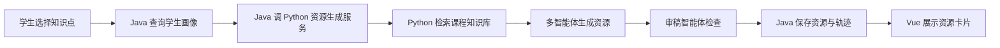
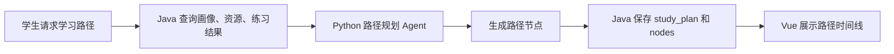

# LearnAgent-A3 用户需求说明书（URD）

User Requirements Document

项目中文名：基于大模型的个性化资源生成与学习多智能体系统开发  
项目英文名：LearnAgent: An LLM-Powered Personalized Learning Resource Generation and Multi-Agent System  
版本：v1.0  
日期：2026-06-01  
适用阶段：Java 软件开发与数据库联合实习 / 中国软件杯 A3 赛题初赛准备  
推荐技术路线：Vue 3 + Java Spring Boot + MySQL + Python FastAPI + Chroma + 大模型 API

---

## 1. 文档目的

本文档用于说明 LearnAgent-A3 系统的用户需求，重点回答以下问题：

1. 系统要解决什么用户问题。
2. 系统面向哪些用户。
3. 用户希望系统提供哪些能力。
4. 系统在比赛、实习和演示场景下应达到什么效果。
5. 哪些需求属于必须完成，哪些属于加分扩展。

URD 面向的主要读者包括：

1. 项目组成员。
2. 实习指导教师。
3. 课程设计/实习验收人员。
4. 软件杯项目评审人员。
5. 后续 SRS、数据库设计和开发实现人员。

---

## 2. 项目背景

高校学生在学习专业课程时，经常遇到以下问题：

1. 课程资料多而杂，学生不知道哪些内容适合自己。
2. 不同学生基础差异大，统一讲义和统一作业难以满足个性化需求。
3. 学生不知道自己的薄弱点在哪里。
4. 学生缺少清晰的学习路径，不知道先学什么、后学什么。
5. 学生遇到问题后，缺少即时、针对性的辅导。
6. 教师或助教难以持续跟踪每个学生的学习状态。

本项目希望基于大模型、多智能体协作、课程知识库检索和数据库持久化，构建一个面向高校课程的个性化学习资源生成系统。系统通过对话了解学生，形成动态学习画像，再根据课程知识库生成个性化学习资源，并规划学习路径、提供智能辅导和学习效果评估。

由于本实习属于 Java 软件开发与数据库联合实习，系统采用 Java Spring Boot 作为业务主后端，MySQL 作为核心业务数据库，Python FastAPI 作为 AI 能力服务。这样既能满足赛题中的大模型和多智能体要求，也能体现 Java 后端开发、数据库设计、表关系建模和业务数据持久化能力。

---

## 3. 项目目标

### 3.1 业务目标

| 编号 | 目标 | 说明 |
|---|---|---|
| G-01 | 帮助学生明确自身学习状态 | 通过自然语言对话生成学生画像 |
| G-02 | 提供个性化学习资源 | 根据画像和课程知识点生成讲义、导图、题目、代码实验等资源 |
| G-03 | 提供动态学习路径 | 根据学生基础、目标、时间和掌握度规划学习顺序 |
| G-04 | 提供智能辅导 | 学生提问时，系统结合课程知识库提供回答 |
| G-05 | 跟踪学习效果 | 根据练习和反馈更新掌握度与画像 |
| G-06 | 支撑课程实习验收 | 体现 Java、数据库、前后端交互和 AI 服务集成 |
| G-07 | 支撑比赛演示 | 在 7 分钟内展示完整闭环和多智能体协作过程 |

### 3.2 学习与实习目标

项目组通过本系统应掌握：

1. Vue 3 前端页面开发。
2. Java Spring Boot 后端接口开发。
3. MySQL 数据库设计和数据持久化。
4. Java 调用 Python 微服务的方式。
5. Python FastAPI AI 服务开发。
6. 大模型 API 调用和 Prompt 设计。
7. RAG 课程知识库检索。
8. 多智能体任务拆分和运行轨迹记录。
9. 软件需求文档、数据库文档和测试文档编写。

---

## 4. 项目范围

### 4.1 范围内

| 模块 | 范围 |
|---|---|
| 学生端 Web 页面 | 登录/演示入口、画像构建、资源生成、路径查看、智能辅导、练习评估 |
| 学生画像 | 通过对话抽取不少于 6 个画像维度，并支持版本更新 |
| 课程知识库 | 至少构建一门完整课程资料，建议为《人工智能导论》 |
| 个性化资源生成 | 至少生成 5 类资源：讲义、思维导图、练习题、拓展阅读、代码实操 |
| 学习路径规划 | 根据画像、掌握度和课程知识点生成学习路径 |
| 智能辅导 | 基于课程知识库进行问答，回答需要包含依据或来源 |
| 学习效果评估 | 根据练习结果更新掌握度和薄弱点 |
| 多智能体运行记录 | 记录画像、检索、规划、生成、审稿、路径等 Agent 运行过程 |
| Java 主后端 | 提供统一 API，负责业务逻辑和 MySQL 持久化 |
| Python AI 服务 | 负责大模型调用、RAG 检索、多智能体编排 |
| MySQL 数据库 | 存储学生、画像、资源、路径、练习结果、Agent 轨迹等数据 |

### 4.2 范围外

| 不做内容 | 原因 |
|---|---|
| 自训练大模型 | 一个月两人项目成本过高，不符合 MVP 目标 |
| 多学校多租户平台 | 会显著增加权限和运维复杂度 |
| 完整教务系统 | 与赛题主线无关 |
| 复杂视频生成平台 | 可用微课脚本和分镜替代 |
| 大规模高并发部署 | 初赛演示重点是功能闭环，不是生产高并发 |
| 完整商业支付和运营后台 | 与实习和比赛目标无关 |

---

## 5. 用户角色

### 5.1 学生用户

学生是系统的核心使用者。

主要需求：

1. 通过聊天快速建立学习画像。
2. 获得适合自己基础和目标的学习资源。
3. 查看系统规划的学习路径。
4. 在不懂时向系统提问。
5. 做题后知道自己哪里错了。
6. 能看到学习进度和掌握度变化。

### 5.2 教师/助教用户

教师或助教主要用于查看学生学习情况和系统生成结果。

主要需求：

1. 查看学生画像。
2. 查看系统生成的学习资源。
3. 查看学生学习路径。
4. 查看练习结果和掌握度。
5. 审查 AI 生成内容是否合理。

### 5.3 项目演示用户

项目演示用户包括评委、实习验收老师和答辩观众。

主要需求：

1. 快速理解系统价值。
2. 看到完整使用流程。
3. 看到 Java + 数据库 + Python AI 服务的架构。
4. 看到多智能体分工和运行轨迹。
5. 看到系统不是普通聊天机器人，而是有学习闭环。

### 5.4 系统管理员

管理员用于维护课程资料和系统基础数据。

主要需求：

1. 管理课程。
2. 管理知识点。
3. 上传或维护课程文档。
4. 查看系统运行状态。
5. 查看 AI 服务调用结果。

---

## 6. 用户画像

### 6.1 Demo 学生画像

| 项目 | 内容 |
|---|---|
| 姓名 | 小林 |
| 年级 | 计算机科学与技术大二 |
| 课程 | 人工智能导论 |
| 学习目标 | 两周内掌握 A* 搜索算法并完成 Python 路径规划实验 |
| 基础情况 | Python 会一点，搜索算法基础较弱 |
| 薄弱点 | 不理解启发式函数，混淆 g(n)、h(n)、f(n) |
| 偏好 | 图解、短讲解、代码案例 |
| 时间 | 每天约 45 分钟 |

### 6.2 教师用户画像

| 项目 | 内容 |
|---|---|
| 身份 | 实习指导教师 / 课程教师 |
| 关注点 | 学生是否完成需求、系统是否能运行、数据库是否设计合理 |
| 期望 | 能看到 Java 后端、数据库表结构、AI 服务调用和前端展示 |

---

## 7. 用户场景

### 7.1 场景一：学生创建学习画像

学生打开系统，在画像构建页面输入自己的学习情况。系统通过 Java 后端调用 Python AI 服务，Python 服务使用大模型抽取画像 JSON，Java 将画像保存到 MySQL，前端展示画像卡片。

用户收益：

1. 学生不用填写复杂表单。
2. 系统能快速理解学生基础、目标和偏好。
3. 后续资源生成和路径规划可以基于画像进行。

### 7.2 场景二：学生生成个性化学习资源

学生选择课程知识点，例如 A* 搜索算法。系统根据学生画像、课程知识库和目标，生成讲义、思维导图、练习题、拓展阅读和代码实操案例。

用户收益：

1. 不同学生获得不同难度和形式的学习资源。
2. 学生可以直接开始学习，而不是在网上乱找资料。
3. 资源与课程知识库关联，降低大模型幻觉风险。

### 7.3 场景三：学生查看学习路径

系统根据知识点依赖、学生薄弱点和可用时间，规划学习路径。例如先复习 BFS/DFS，再学习启发式函数，最后完成 A* 代码实验。

用户收益：

1. 学生知道先学什么、后学什么。
2. 学习任务被拆成可完成的小步骤。
3. 学习路径可以根据练习结果动态调整。

### 7.4 场景四：学生进行智能辅导

学生问：“A* 中 g(n) 和 h(n) 有什么区别？”系统检索课程资料，结合学生画像给出解释、例子和推荐练习。

用户收益：

1. 学生获得即时帮助。
2. 回答更贴合学生基础。
3. 系统可以记录问题，更新薄弱点。

### 7.5 场景五：教师查看学习效果

教师查看学生画像、生成资源、练习结果和 Agent 运行轨迹。

用户收益：

1. 教师能了解学生学习情况。
2. 教师能审查 AI 生成内容。
3. 实习验收时能证明数据库和后端真实工作。

---

## 8. 用户需求

### 8.1 学习画像需求

| 编号 | 用户需求 | 优先级 |
|---|---|---|
| UR-01 | 学生希望通过自然语言描述学习情况，而不是填写复杂表单 | 必须 |
| UR-02 | 学生希望系统自动提取专业、课程、目标、基础、薄弱点、偏好、时间等信息 | 必须 |
| UR-03 | 学生希望能查看系统生成的画像 | 必须 |
| UR-04 | 学生希望画像可以随着练习结果和反馈更新 | 应该 |
| UR-05 | 教师希望查看学生画像历史版本 | 可选 |

### 8.2 个性化资源需求

| 编号 | 用户需求 | 优先级 |
|---|---|---|
| UR-06 | 学生希望系统根据自己的情况生成学习资料 | 必须 |
| UR-07 | 学生希望系统至少生成讲义、导图、题目、阅读材料、代码实验 5 类资源 | 必须 |
| UR-08 | 学生希望资源难度和形式符合自己的基础与偏好 | 必须 |
| UR-09 | 学生希望资源能保存，后续可以再次查看 | 必须 |
| UR-10 | 教师希望查看资源生成依据和 Agent 运行过程 | 应该 |

### 8.3 学习路径需求

| 编号 | 用户需求 | 优先级 |
|---|---|---|
| UR-11 | 学生希望系统给出学习步骤和顺序 | 必须 |
| UR-12 | 学生希望每一步都有推荐资源和推荐理由 | 必须 |
| UR-13 | 学生希望路径可以根据练习结果调整 | 应该 |
| UR-14 | 教师希望查看学生路径完成情况 | 可选 |

### 8.4 智能辅导需求

| 编号 | 用户需求 | 优先级 |
|---|---|---|
| UR-15 | 学生希望在学习过程中向系统提问 | 应该 |
| UR-16 | 学生希望回答能结合课程资料，而不是凭空回答 | 应该 |
| UR-17 | 学生希望回答能给出图解、例子或下一步建议 | 可选 |

### 8.5 学习评估需求

| 编号 | 用户需求 | 优先级 |
|---|---|---|
| UR-18 | 学生希望完成练习后知道对错和解析 | 应该 |
| UR-19 | 学生希望系统指出自己的薄弱点 | 应该 |
| UR-20 | 学生希望系统根据错题推荐补救资源 | 可选 |
| UR-21 | 教师希望查看练习结果和掌握度 | 可选 |

### 8.6 系统演示需求

| 编号 | 用户需求 | 优先级 |
|---|---|---|
| UR-22 | 评委希望在短时间内看懂系统完整流程 | 必须 |
| UR-23 | 评委希望看到多智能体协作过程 | 必须 |
| UR-24 | 指导教师希望看到 Java 后端和数据库设计 | 必须 |
| UR-25 | 指导教师希望系统可以本地运行 | 必须 |

---

## 9. 业务流程

### 9.1 画像生成流程

### 9.2 资源生成流程

### 9.3 学习路径流程

---

## 10. 非功能性用户需求

| 编号 | 需求 | 说明 | 优先级 |
|---|---|---|---|
| NUR-01 | 易用性 | 学生无需学习复杂操作即可完成画像构建和资源生成 | 必须 |
| NUR-02 | 可理解性 | 页面文字、资源卡片和路径说明要清晰 | 必须 |
| NUR-03 | 稳定性 | 演示过程中核心流程不能频繁失败 | 必须 |
| NUR-04 | 可追踪性 | 关键 AI 生成过程需要保存 Agent 运行记录 | 必须 |
| NUR-05 | 可维护性 | Java、Python、前端、数据库分层清晰 | 应该 |
| NUR-06 | 安全性 | API Key 不得暴露在前端和仓库 | 必须 |
| NUR-07 | 响应体验 | 长时间生成任务应显示进度或状态 | 应该 |
| NUR-08 | 内容可靠性 | 课程问答和资源生成应尽量基于课程知识库 | 应该 |

---

## 11. 验收标准

### 11.1 必须验收项

| 编号 | 验收项 |
|---|---|
| AC-01 | Vue 前端可以访问并展示主要页面 |
| AC-02 | Java Spring Boot 可以启动并提供 `/api/health` |
| AC-03 | Python FastAPI 可以启动并提供 `/ai/health` |
| AC-04 | MySQL 中存在核心业务表 |
| AC-05 | 前端只调用 Java 后端，不直接调用 Python |
| AC-06 | Java 能调用 Python AI 服务 |
| AC-07 | 学生输入学习情况后，系统能生成画像 |
| AC-08 | 画像能保存到 `profile_snapshot` 表 |
| AC-09 | 系统能生成至少 5 类个性化学习资源 |
| AC-10 | 系统能生成学习路径 |
| AC-11 | 系统能保存 Agent 运行记录 |
| AC-12 | 系统能完成一条 7 分钟演示主线 |

### 11.2 加分验收项

| 编号 | 验收项 |
|---|---|
| AC-13 | 智能辅导回答带课程知识库来源 |
| AC-14 | 练习结果能影响学生画像和推荐路径 |
| AC-15 | 页面展示 Agent 运行轨迹 |
| AC-16 | 提供数据库 ER 图和表结构说明 |
| AC-17 | 提供 Docker Compose 或一键启动脚本 |

---

## 12. 风险与约束

| 风险 | 影响 | 应对 |
|---|---|---|
| Java 与 Python 联调复杂 | 影响开发进度 | 先用 mock 数据固定接口格式 |
| 大模型 API 不稳定 | 影响演示 | 准备缓存结果和演示数据 |
| 数据库设计过复杂 | 开发成本上升 | 先做 10 张核心表，后续再扩展 |
| 资源生成质量不稳定 | 影响用户体验 | 加入审稿 Agent 和模板约束 |
| 前端直接调用 Python | 架构混乱 | 规定前端只调用 Java |
| API Key 泄露 | 安全风险 | 只放后端环境变量，不提交 Git |

---

## 13. 用户需求优先级总结

| 优先级 | 必须完成内容 |
|---|---|
| P0 | Vue 页面、Java 后端、MySQL、Python AI 服务、画像生成、资源生成、学习路径、Agent 记录 |
| P1 | 智能辅导、学习评估、课程知识库 RAG、资源引用 |
| P2 | 教师视图、动态路径调整、演示缓存、一键部署 |

---

## 14. 结论

LearnAgent-A3 的核心用户需求不是“做一个聊天机器人”，而是做一个能围绕学生学习过程工作的 AI 助教系统。它需要通过学生画像理解用户，通过课程知识库降低幻觉，通过多智能体生成资源，通过学习路径组织学习过程，通过练习反馈形成闭环。

对于本实习而言，系统还必须清楚体现 Java 软件开发和数据库能力。因此推荐架构为：

> Vue 3 前端 + Java Spring Boot 主后端 + MySQL 业务数据库 + Python FastAPI AI 服务 + Chroma 向量库 + 大模型 API。

该架构既满足赛题的大模型和多智能体要求，也符合 Java 与数据库联合实习的交付目标。
