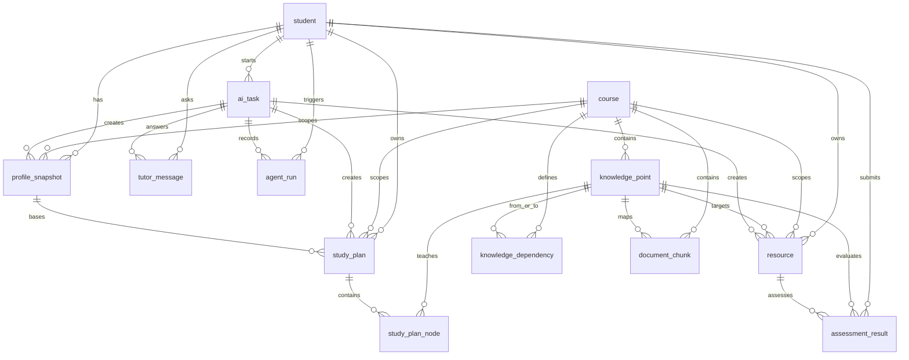

# LearnAgent-A3 数据库设计说明书（DBDD）

Database Design Description

项目中文名：基于大模型的个性化资源生成与学习多智能体系统开发  
项目英文名：LearnAgent: An LLM-Powered Personalized Learning Resource Generation and Multi-Agent System  
版本：v1.0  
日期：2026-06-03  
数据库：MySQL 8.x  
相关文档：`docs/URD.md`、`docs/SRS.md`

---

## 1. 文档目的

本文档说明 LearnAgent-A3 的数据库设计，重点覆盖：

1. URD/SRS 中要求的核心业务数据。
2. Vue 前端 Pinia store 所需的数据返回形态。
3. Java Spring Boot 后端持久化和查询时的表关系。
4. 多智能体任务、学习画像、资源生成、学习路径、智能辅导、学习评估的存储设计。

数据库脚本位于：

| 文件 | 说明 |
|---|---|
| `database/schema.sql` | 建库、建表、外键、索引、视图 |
| `database/seed.sql` | 演示种子数据 |
| `database/README.md` | 导入说明和常用查询 |

---

## 2. 设计依据

### 2.1 URD 数据需求

URD 要求系统存储：

| 需求 | 数据库支持 |
|---|---|
| 学生画像 | `profile_snapshot` |
| 个性化资源 | `resource` |
| 学习路径 | `study_plan`、`study_plan_node` |
| 智能辅导 | `tutor_message`、`document_chunk` |
| 学习效果评估 | `assessment_result` |
| 多智能体运行记录 | `ai_task`、`agent_run` |
| 课程知识库 | `course`、`knowledge_point`、`knowledge_dependency`、`document_chunk` |

### 2.2 SRS 数据需求

SRS 明确提出 10 张核心数据表：

| SRS 表 | 当前数据库 |
|---|---|
| `student` | 已实现 |
| `course` | 已实现 |
| `knowledge_point` | 已实现 |
| `profile_snapshot` | 已实现 |
| `resource` | 已实现 |
| `study_plan` | 已实现 |
| `study_plan_node` | 已实现 |
| `assessment_result` | 已实现 |
| `agent_run` | 已实现 |
| `document_chunk` | 已实现 |

同时根据 SRS 流程补充 3 张支撑表：

| 补充表 | 原因 |
|---|---|
| `ai_task` | SRS 要求 Java 创建任务记录，且所有 Agent 轨迹应通过 `task_id` 关联 |
| `knowledge_dependency` | SRS 要求学习路径基于知识点依赖生成 |
| `tutor_message` | SRS 要求智能辅导回答包含来源并可追踪 |

---

## 3. 前端 Store 兼容性检查

当前前端 store 不直接访问数据库，而是通过 Java API 获取 JSON。数据库采用 snake_case 命名，前端使用 camelCase 字段，因此直接按表字段返回会存在冲突。

### 3.1 已发现冲突点

| 前端模块 | 前端期望字段 | 数据库原始字段 | 处理方式 |
|---|---|---|---|
| `profileStore` | `taskId`、`profileSnapshotId`、`profile`、`createdAt` | `task_id`、`id`、`profile_json`、`created_at` | 新增 `v_api_latest_profile`、`v_api_profile_history` |
| `resourceStore` | `resourceType`、`qualityScore`、`createdAt` | `resource_type`、`quality_score`、`created_at` | 新增 `v_api_resource` |
| `studyPlanStore` | `planId`、`nodes`、节点 `order`、`knowledgePoint`、`estimatedDuration`、`completionCriteria` | `id`、`study_plan_node`、`node_order`、`knowledge_point_name`、`estimated_minutes`、`completion_criteria` | 新增 `v_api_study_plan`、`v_api_study_plan_node` |
| `tutorStore` | `answer`、`sources`、`suggestedResources`、`agentTrace` | `tutor_message.content`、`sources_json`、`suggested_resource_ids`、`agent_run` | 新增 `v_api_tutor_message`，后端聚合回答和 Agent 轨迹 |
| `analyticsStore` | `totalQuizzes`、`averageScore`、`masteryMap`、`weakPoints`、`recentResults` | `assessment_result`、`profile_snapshot.profile_json` | 新增 `v_api_analytics` |
| `agentRunStore` | `taskId`、`agentName`、`inputSummary`、`latencyMs`、`createdAt` | `task_id`、`agent_name`、`input_summary`、`latency_ms`、`created_at` | 新增 `v_api_agent_run` |

### 3.2 已修改数据库的兼容措施

1. 保留规范化业务表，不强行把数据库列改成 camelCase。
2. 新增 `v_api_*` 视图，让 Java 后端可以直接查询接近前端响应结构的数据。
3. 在 `seed.sql` 中保留 `task_dp_001`，同时增加 `task_mock_001` 兼容前端 Agent 记录页默认查询值。
4. 学习路径节点保留 `estimated_minutes`，并在 `v_api_study_plan_node` 中生成 `estimatedDuration`，格式为 `xx 分钟`。

结论：当前数据库与前端 store 没有不可解决的结构冲突。后端按 `v_api_*` 视图或 DTO 映射返回即可兼容现有前端。

---

## 4. 新手阅读和试用顺序

ER 图里的线很多，第一次不要从完整 ER 图开始看。建议按前端页面顺序理解：

```text
学生 student
  ↓
画像 profile_snapshot
  ↓
资源 resource
  ↓
学习路径 study_plan / study_plan_node
  ↓
测验统计 assessment_result
  ↓
智能体记录 ai_task / agent_run
```

如果只想先跑通一条演示主线，可以记住下面 6 张表：

| 先看 | 表 | 你可以理解成 |
|---|---|---|
| 1 | `student` | 当前登录的学生 |
| 2 | `profile_snapshot` | 学生学习画像 |
| 3 | `resource` | AI 生成的讲义、导图、练习、阅读、代码实验 |
| 4 | `study_plan` | 一条学习计划 |
| 5 | `study_plan_node` | 学习计划里的每一步 |
| 6 | `agent_run` | 每个 Agent 做了什么 |

其他表暂时这样理解：

| 表 | 简单理解 |
|---|---|
| `course` | 当前课程 |
| `knowledge_point` | 课程知识点 |
| `knowledge_dependency` | 知识点先后关系 |
| `document_chunk` | RAG 检索用的课程文本片段 |
| `ai_task` | 一次 AI 调用任务 |
| `assessment_result` | 测验结果 |
| `tutor_message` | 智能辅导聊天记录 |

### 4.1 表的白话解释

| 表名 | 中文含义 | 它存什么 | 举例 |
|---|---|---|---|
| `student` | 学生表 | 学生姓名、专业、年级等基础信息 | 小林、计算机科学与技术、大二 |
| `course` | 课程表 | 课程名称、课程编码、课程范围 | 算法设计与分析：动态规划专题 |
| `knowledge_point` | 知识点表 | 某门课下面拆出来的知识点 | 状态定义、状态转移方程、01 背包 |
| `knowledge_dependency` | 知识点依赖表 | 哪个知识点应该先学，哪个后学 | 先学状态定义，再学状态转移方程 |
| `document_chunk` | 文档切片表 | 从课程资料里切出来的一小段文本，用于 RAG 检索 | `05_01_knapsack.md` 里关于一维优化的一段 |
| `profile_snapshot` | 画像快照表 | 学生在某个时间点的学习画像 JSON | 薄弱点、偏好、掌握度 |
| `resource` | 学习资源表 | AI 生成的讲义、导图、练习、阅读、代码实验 | “动态规划四步法讲义” |
| `study_plan` | 学习路径主表 | 一整条学习计划 | “小林的动态规划专题学习路径” |
| `study_plan_node` | 学习路径节点表 | 学习计划里的每一步 | 第 1 步：动态规划基本思想 |
| `assessment_result` | 测验结果表 | 学生做题得分、错题详情、掌握度变化 | 状态定义专项测验 70 分 |
| `ai_task` | AI 任务表 | 一次 AI 流程的总记录 | `task_dp_001` 资源生成任务 |
| `agent_run` | Agent 运行表 | 一个任务里每个 Agent 的执行记录 | RetrieverAgent 检索了哪些资料 |
| `tutor_message` | 智能辅导消息表 | 学生问答记录、引用来源、推荐资源 | “01 背包为什么倒序遍历？” |

`document_chunk` 可以理解成“课程资料的小碎片”。例如原始课程资料是一篇完整 Markdown：

```text
05_01_knapsack.md
```

系统不会每次把整篇文章都丢给大模型，而是先切成几段，比如：

```text
chunk_knapsack_001:
01 背包中 dp[i][w] 表示只考虑前 i 个物品，背包容量不超过 w 时可以获得的最大价值。
```

学生问问题时，RetrieverAgent 先从 `document_chunk` 或 Chroma 向量库里找相关片段，再把片段交给大模型回答。这样回答更容易贴合课程资料，减少胡编。

### 4.2 ER 图连线词解释

ER 图上的英文连线词是关系标签，不是表字段。它们表示两张表之间是什么业务关系。

| 连线词 | 中文意思 | 例子 |
|---|---|---|
| `starts` | 发起 | `student starts ai_task`：学生发起一次 AI 任务 |
| `has` | 拥有 | `student has profile_snapshot`：一个学生有多个画像快照 |
| `owns` | 拥有 | `student owns resource`：一个学生拥有多条生成资源 |
| `submits` | 提交 | `student submits assessment_result`：学生提交测验结果 |
| `asks` | 提问 | `student asks tutor_message`：学生产生辅导问答消息 |
| `triggers` | 触发 | `student triggers agent_run`：学生任务触发 Agent 运行 |
| `scopes` | 限定范围 / 属于某课程范围 | `course scopes resource`：资源属于某门课程范围 |
| `contains` | 包含 | `course contains knowledge_point`：课程包含多个知识点 |
| `defines` | 定义 | `course defines knowledge_dependency`：课程定义知识点依赖关系 |
| `maps` | 映射到 | `knowledge_point maps document_chunk`：知识点对应课程文档片段 |
| `targets` | 面向 / 针对 | `knowledge_point targets resource`：资源针对某个知识点生成 |
| `teaches` | 教授 / 学习 | `knowledge_point teaches study_plan_node`：路径节点学习某个知识点 |
| `creates` | 创建 | `ai_task creates resource`：AI 任务创建资源 |
| `records` | 记录 | `ai_task records agent_run`：任务记录各 Agent 的运行过程 |
| `answers` | 回答 | `ai_task answers tutor_message`：AI 任务生成辅导回答 |
| `bases` | 基于 | `profile_snapshot bases study_plan`：学习路径基于某次画像生成 |
| `assesses` | 测评 | `resource assesses assessment_result`：练习资源产生测验结果 |
| `evaluates` | 评估 | `knowledge_point evaluates assessment_result`：测验结果评估某个知识点 |
| `from_or_to` | 依赖起点或终点 | `knowledge_point from_or_to knowledge_dependency`：知识点可以是依赖关系的前置或后续节点 |

例如 `scopes` 最容易误解。它不是“范围表”，而是说某条数据归属于某个课程范围：

```text
course scopes resource
```

意思是：一条 `resource` 不是凭空存在的，它必须属于某门 `course`。比如“01 背包代码实验”这条资源属于“算法设计与分析：动态规划专题”这门课。

### 4.3 主要业务链路

#### 画像生成链路

```text
student
  发起 ai_task
  生成 profile_snapshot
  每个 Agent 的过程写入 agent_run
```

对应表：

```text
student → ai_task → profile_snapshot
                 ↘ agent_run
```

#### 资源生成链路

```text
student 选择 course 和 knowledge_point
  ↓
ai_task 创建一次资源生成任务
  ↓
RetrieverAgent 从 document_chunk 检索课程片段
  ↓
多个 Agent 生成 resource
  ↓
agent_run 记录每个 Agent 做了什么
```

对应表：

```text
student + course + knowledge_point
  → ai_task
  → document_chunk
  → resource
  → agent_run
```

#### 学习路径链路

```text
course 有多个 knowledge_point
knowledge_dependency 记录知识点先后关系
profile_snapshot 记录学生薄弱点
系统据此生成 study_plan 和 study_plan_node
```

对应表：

```text
course → knowledge_point → knowledge_dependency
student → profile_snapshot → study_plan → study_plan_node
```

#### 智能辅导链路

```text
student 提问
  ↓
tutor_message 保存用户问题
  ↓
ai_task 调用 AI
  ↓
document_chunk 提供课程来源
  ↓
tutor_message 保存 AI 回答和来源
```

对应表：

```text
student → tutor_message
ai_task → tutor_message
document_chunk → tutor_message.sources_json
```

### 4.4 最快试用方式

先导入数据库：

```powershell
mysql -u root -p < database/schema.sql
mysql -u root -p learnagent_a3 < database/seed.sql
```

再执行试用脚本：

```powershell
mysql -u root -p learnagent_a3 < database/try_queries.sql
```

`try_queries.sql` 会做三件事：

1. 查询学生、课程、知识点、画像、资源、路径、Agent 记录。
2. 模拟前端实际需要的数据视图，例如 `v_api_resource`、`v_api_study_plan_node`。
3. 写入一条测试 AI 任务和一条测试资源，方便确认表能写。

如果测试后不想保留数据，可以执行：

```sql
DELETE FROM resource WHERE task_id = 'task_try_001';
DELETE FROM ai_task WHERE task_id = 'task_try_001';
```

---

## 5. 逻辑模型



---

## 6. 物理表设计

### 6.1 `student`

学生基础信息表。

| 字段 | 类型 | 说明 |
|---|---|---|
| `id` | BIGINT PK | 学生 ID |
| `name` | VARCHAR(64) | 姓名 |
| `student_no` | VARCHAR(64) | 学号或演示账号 |
| `major` | VARCHAR(128) | 专业 |
| `grade` | VARCHAR(32) | 年级 |
| `email` | VARCHAR(128) | 邮箱 |
| `status` | VARCHAR(32) | `active` / `disabled` |
| `created_at` | DATETIME | 创建时间 |
| `updated_at` | DATETIME | 更新时间 |

### 6.2 `course`

课程信息表。

| 字段 | 类型 | 说明 |
|---|---|---|
| `id` | BIGINT PK | 课程 ID |
| `course_code` | VARCHAR(64) | 课程编码 |
| `course_name` | VARCHAR(128) | 课程名称 |
| `description` | TEXT | 课程说明 |
| `stage_scope` | JSON | 演示范围、重点和排除项 |
| `status` | VARCHAR(32) | 状态 |
| `created_at` | DATETIME | 创建时间 |
| `updated_at` | DATETIME | 更新时间 |

### 6.3 `ai_task`

AI 任务记录表。Java 后端在调用 Python AI 服务前创建任务，后续画像、资源、路径、辅导、评估和 Agent 轨迹都通过 `task_id` 串联。

| 字段 | 类型 | 说明 |
|---|---|---|
| `id` | BIGINT PK | 内部主键 |
| `task_id` | VARCHAR(64) | 对外任务 ID |
| `student_id` | BIGINT FK | 学生 |
| `course_id` | BIGINT FK | 课程 |
| `task_type` | VARCHAR(64) | 任务类型 |
| `request_json` | JSON | 请求摘要 |
| `response_json` | JSON | 响应摘要 |
| `status` | VARCHAR(32) | `created` / `running` / `success` / `failed` |
| `started_at` | DATETIME | 开始时间 |
| `finished_at` | DATETIME | 结束时间 |
| `created_at` | DATETIME | 创建时间 |
| `updated_at` | DATETIME | 更新时间 |

### 6.4 `knowledge_point`

课程知识点表。

| 字段 | 类型 | 说明 |
|---|---|---|
| `id` | BIGINT PK | 知识点 ID |
| `course_id` | BIGINT FK | 所属课程 |
| `point_key` | VARCHAR(96) | 业务标识 |
| `name` | VARCHAR(128) | 名称 |
| `point_type` | VARCHAR(32) | `concept` / `method` / `problem` / `optimization` |
| `difficulty` | TINYINT | 难度 1-5 |
| `chapter_file` | VARCHAR(255) | 来源章节文件 |
| `learning_outcomes` | JSON | 学习产出 |
| `demo_priority` | VARCHAR(32) | 演示优先级 |
| `sort_order` | INT | 排序 |

### 6.5 `knowledge_dependency`

知识点依赖关系表，用于学习路径规划。

| 字段 | 类型 | 说明 |
|---|---|---|
| `id` | BIGINT PK | 主键 |
| `course_id` | BIGINT FK | 课程 |
| `from_knowledge_point_id` | BIGINT FK | 前置知识点 |
| `to_knowledge_point_id` | BIGINT FK | 后续知识点 |
| `relation` | VARCHAR(64) | 依赖关系类型 |
| `created_at` | DATETIME | 创建时间 |

### 6.6 `document_chunk`

RAG 文档切片元数据表。向量本身由 Chroma 存储，MySQL 只保存业务元数据和切片文本。

| 字段 | 类型 | 说明 |
|---|---|---|
| `id` | BIGINT PK | 切片 ID |
| `chunk_key` | VARCHAR(128) | 切片业务标识 |
| `course_id` | BIGINT FK | 课程 |
| `knowledge_point_id` | BIGINT FK | 关联知识点 |
| `source_file` | VARCHAR(255) | 来源文件 |
| `title` | VARCHAR(255) | 标题 |
| `content` | LONGTEXT | 切片文本 |
| `embedding_status` | VARCHAR(32) | 向量化状态 |
| `vector_collection` | VARCHAR(128) | Chroma collection |
| `metadata` | JSON | 元数据 |

### 6.7 `profile_snapshot`

学生画像快照表，支持多版本画像。

| 字段 | 类型 | 说明 |
|---|---|---|
| `id` | BIGINT PK | 快照 ID |
| `student_id` | BIGINT FK | 学生 |
| `course_id` | BIGINT FK | 课程 |
| `task_id` | VARCHAR(64) FK | 画像任务 ID |
| `profile_json` | JSON | 画像内容 |
| `source` | VARCHAR(32) | `conversation` / `assessment` / `manual` |
| `version_no` | INT | 版本号 |
| `created_at` | DATETIME | 创建时间 |

### 6.8 `resource`

个性化学习资源表，支持至少 5 类资源。

| 字段 | 类型 | 说明 |
|---|---|---|
| `id` | BIGINT PK | 资源 ID |
| `student_id` | BIGINT FK | 学生 |
| `course_id` | BIGINT FK | 课程 |
| `knowledge_point_id` | BIGINT FK | 知识点 |
| `task_id` | VARCHAR(64) FK | 生成任务 ID |
| `resource_type` | VARCHAR(64) | `explanation_doc` / `mindmap` / `quiz` / `reading_material` / `code_lab` |
| `title` | VARCHAR(255) | 标题 |
| `content` | LONGTEXT | 内容 |
| `format` | VARCHAR(32) | `markdown` / `mermaid` / `json` / `code` |
| `quality_score` | DECIMAL(4,2) | 质量分 |
| `status` | VARCHAR(32) | 状态 |
| `sources_json` | JSON | 来源 |
| `review_json` | JSON | 审稿结果 |

### 6.9 `study_plan` 与 `study_plan_node`

学习路径主表和节点表。

| 表 | 说明 |
|---|---|
| `study_plan` | 一条学生课程学习路径 |
| `study_plan_node` | 路径中的每一步学习任务 |

`study_plan_node` 中的 `recommended_resource_ids` 使用 JSON 数组保存资源 ID，便于前端直接展示，也避免在 MVP 阶段增加过多中间表。

### 6.10 `assessment_result`

练习评估结果表。

| 字段 | 类型 | 说明 |
|---|---|---|
| `id` | BIGINT PK | 评估 ID |
| `student_id` | BIGINT FK | 学生 |
| `course_id` | BIGINT FK | 课程 |
| `knowledge_point_id` | BIGINT FK | 知识点 |
| `resource_id` | BIGINT FK | 关联练习资源 |
| `task_id` | VARCHAR(64) FK | 评估任务 |
| `quiz_title` | VARCHAR(255) | 测验名称 |
| `score` | DECIMAL(6,2) | 得分 |
| `total_score` | DECIMAL(6,2) | 总分 |
| `mastery_delta_json` | JSON | 掌握度变化 |
| `details_json` | JSON | 题目对错和解析 |
| `submitted_at` | DATETIME | 提交时间 |

### 6.11 `agent_run`

多智能体运行记录表。

| 字段 | 类型 | 说明 |
|---|---|---|
| `id` | BIGINT PK | 记录 ID |
| `task_id` | VARCHAR(64) FK | 所属任务 |
| `student_id` | BIGINT FK | 学生 |
| `course_id` | BIGINT FK | 课程 |
| `agent_name` | VARCHAR(64) | Agent 名称 |
| `agent_role` | VARCHAR(128) | Agent 职责 |
| `input_summary` | TEXT | 输入摘要 |
| `output_summary` | TEXT | 输出摘要 |
| `model_name` | VARCHAR(64) | 模型或工具 |
| `status` | VARCHAR(32) | `success` / `failed` / `running` |
| `latency_ms` | INT | 耗时 |
| `error_message` | TEXT | 错误信息 |
| `trace_json` | JSON | 详细轨迹 |
| `created_at` | DATETIME | 创建时间 |

### 6.12 `tutor_message`

智能辅导问答记录表。

| 字段 | 类型 | 说明 |
|---|---|---|
| `id` | BIGINT PK | 消息 ID |
| `session_id` | VARCHAR(64) | 会话 ID |
| `task_id` | VARCHAR(64) FK | 回答生成任务 |
| `student_id` | BIGINT FK | 学生 |
| `course_id` | BIGINT FK | 课程 |
| `message_role` | VARCHAR(16) | `user` / `assistant` / `system` |
| `content` | LONGTEXT | 消息内容 |
| `sources_json` | JSON | 来源 |
| `suggested_resource_ids` | JSON | 推荐资源 |
| `safety_status` | VARCHAR(32) | 安全状态 |
| `created_at` | DATETIME | 创建时间 |

---

## 7. API 兼容视图

为减少 Java 后端 DTO 映射成本，数据库提供以下视图：

| 视图 | 用途 |
|---|---|
| `v_api_latest_profile` | 返回最新画像，字段接近 `profileStore.fetchLatest` |
| `v_api_profile_history` | 返回画像历史，字段接近 `profileStore.fetchHistory` |
| `v_api_resource` | 返回资源列表和详情，字段接近 `resourceStore` |
| `v_api_study_plan` | 返回学习路径主信息 |
| `v_api_study_plan_node` | 返回学习路径节点，字段接近 `TimelineNode.vue` |
| `v_api_agent_run` | 返回 Agent 运行记录，字段接近 `AgentRecords.vue` |
| `v_api_assessment_result` | 返回测验结果，字段接近 `Statistics.vue` |
| `v_api_analytics` | 聚合统计数据，字段接近 `analyticsStore` |
| `v_api_tutor_message` | 返回辅导消息，字段接近 `tutorStore` |

注意：复杂响应仍建议由 Java Service 层聚合。例如 `/api/study-plan/{studentId}` 应查询 `v_api_study_plan` 和 `v_api_study_plan_node`，组装成：

```json
{
  "planId": 3001,
  "studentId": 1,
  "courseId": 1,
  "nodes": []
}
```

---

## 8. 推荐后端查询

### 8.1 查询最新画像

```sql
SELECT taskId, profileSnapshotId, profile, createdAt
FROM v_api_latest_profile
WHERE studentId = 1 AND courseId = 1;
```

### 8.2 查询画像历史

```sql
SELECT id, profile, source, createdAt
FROM v_api_profile_history
WHERE studentId = 1
ORDER BY createdAt DESC;
```

### 8.3 查询资源列表

```sql
SELECT id, resourceType, title, format, qualityScore, status, createdAt
FROM v_api_resource
WHERE studentId = 1
ORDER BY createdAt DESC;
```

### 8.4 查询学习路径节点

```sql
SELECT `order`, knowledgePoint, recommendedResourceIds, estimatedDuration, reason, completionCriteria, status
FROM v_api_study_plan_node
WHERE planId = 3001
ORDER BY `order`;
```

### 8.5 查询 Agent 轨迹

```sql
SELECT taskId, agentName, inputSummary, outputSummary, modelName, status, latencyMs, createdAt
FROM v_api_agent_run
WHERE taskId = 'task_dp_001'
ORDER BY createdAt;
```

### 8.6 查询统计数据

```sql
SELECT studentId, totalQuizzes, averageScore, masteryMap, weakPoints, recentResults
FROM v_api_analytics
WHERE studentId = 1;
```

---

## 9. 导入与验证

导入顺序：

```powershell
mysql -u root -p < database/schema.sql
mysql -u root -p learnagent_a3 < database/seed.sql
```

基本验证：

```sql
USE learnagent_a3;
SHOW TABLES;
SELECT COUNT(*) FROM resource;
SELECT COUNT(*) FROM agent_run WHERE task_id = 'task_dp_001';
SELECT COUNT(*) FROM agent_run WHERE task_id = 'task_mock_001';
```

---

## 10. 当前限制

1. `recommended_resource_ids` 使用 JSON 数组，MVP 阶段足够；如果后续需要强外键约束，可拆成 `study_plan_node_resource` 中间表。
2. `v_api_analytics` 适合演示和简单统计；生产环境可由 Java 层更精细地分页和排序最近测验。
3. RAG 向量本体不存 MySQL，只存 `document_chunk` 元数据，向量索引交给 Chroma。
4. 智能辅导接口的最终响应需要 Java 聚合 `tutor_message` 和 `agent_run`，数据库提供基础数据和兼容视图。

---

## 11. 结论

当前数据库设计覆盖 URD 和 SRS 的核心要求，并已针对前端 store 的 camelCase 字段、资源类型、学习路径节点、统计数据和 Agent 记录页默认任务 ID 做了兼容处理。

数据库不要求前端直接改动；Java 后端可以优先查询 `v_api_*` 视图，再按接口 DTO 返回给现有 Vue 前端。
