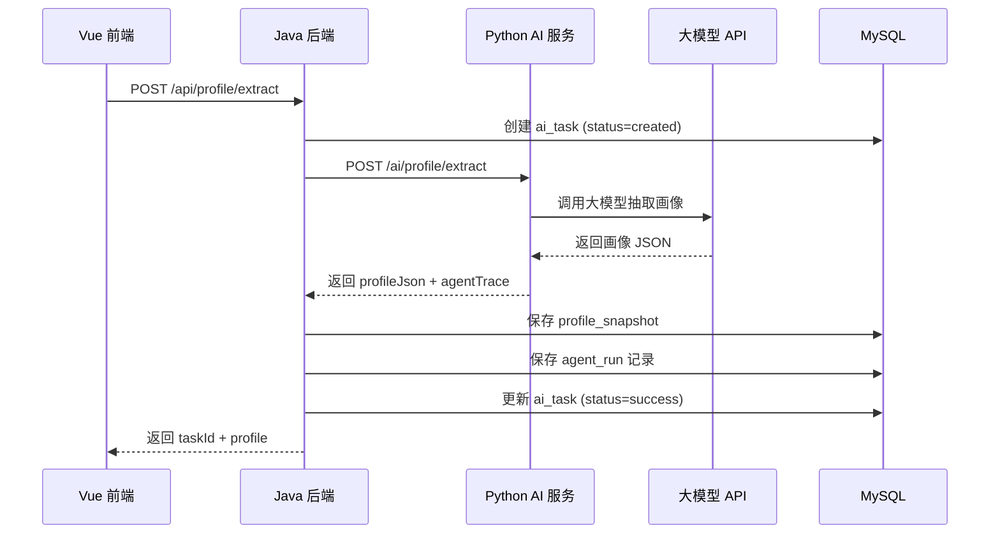
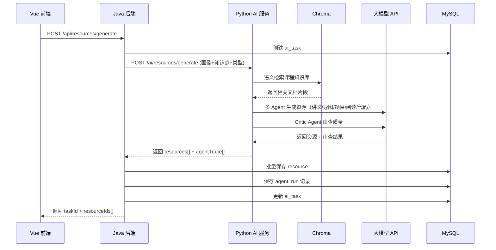
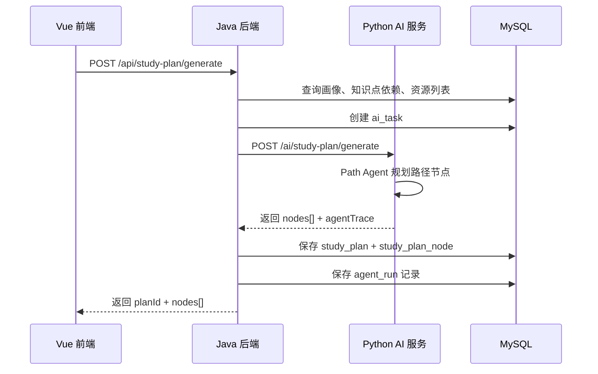
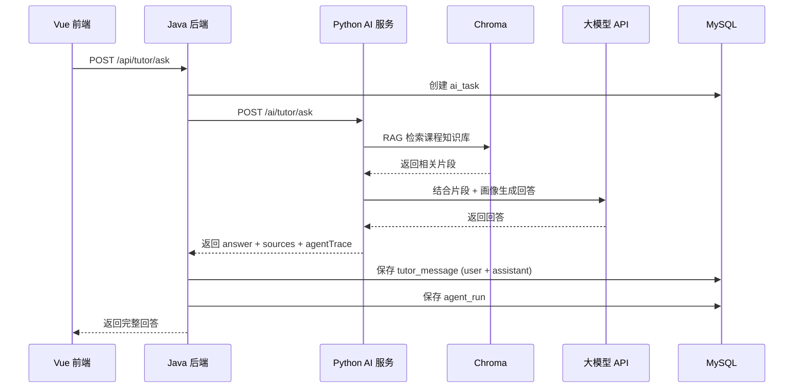

# LearnAgent-A3 软件设计说明书（SDD）

Software Design Description

项目中文名：基于大模型的个性化资源生成与学习多智能体系统开发
项目英文名：LearnAgent: An LLM-Powered Personalized Learning Resource Generation and Multi-Agent System
版本：v1.0
日期：2026-06-03
相关文档：`docs/URD.md`、`docs/SRS.md`、`docs/DBDD.md`、`docs/IDD.md`

---

## 1. 文档目的

本文档在 SRS 的基础上，对 LearnAgent-A3 的软件架构、模块划分、关键流程、错误处理和安全设计进行详细说明，指导 Java 后端、Python AI 服务和前端的开发实现。

---

## 2. 系统总体架构

### 2.1 架构图

```text
┌─────────────────────────────────────────────────────────┐
│                    Vue 3 前端 (Vite)                     │
│  ┌──────┐ ┌────────┐ ┌────────┐ ┌────────┐ ┌────────┐  │
│  │Pinia │ │ Router │ │ Element│ │ Axios  │ │ ECharts│  │
│  │Stores│ │        │ │ Plus   │ │ (→/api)│ │Mermaid │  │
│  └──────┘ └────────┘ └────────┘ └───┬────┘ └────────┘  │
└─────────────────────────────────────┼───────────────────┘
                                      │ HTTP (JSON)
                                      ▼
┌─────────────────────────────────────────────────────────┐
│              Java Spring Boot 主后端 (:8080)             │
│  ┌────────────┐ ┌────────────┐ ┌────────────────────┐   │
│  │ Controller │→│  Service   │→│ Mapper / Repository│   │
│  │  /api/*    │ │  业务逻辑   │ │    MyBatis-Plus    │   │
│  └────────────┘ └─────┬──────┘ └────────┬───────────┘   │
│                       │                  │               │
│                       │ HTTP             │ JDBC          │
│                       ▼                  ▼               │
│              ┌────────────┐      ┌─────────────┐        │
│              │ Python AI  │      │  MySQL 8.x  │        │
│              │  Client    │      │  业务数据库   │        │
│              └────────────┘      └─────────────┘        │
└───────────────────────┼─────────────────────────────────┘
                        │ HTTP (JSON)
                        ▼
┌─────────────────────────────────────────────────────────┐
│            Python FastAPI AI 服务 (:8000)                 │
│  ┌──────────┐ ┌──────────┐ ┌──────────┐ ┌────────────┐  │
│  │ Profile  │ │Retriever │ │ Resource │ │   Path     │  │
│  │  Agent   │ │  Agent   │ │  Agent   │ │   Agent    │  │
│  └──────────┘ └──────────┘ └──────────┘ └────────────┘  │
│  ┌──────────┐ ┌──────────┐ ┌──────────┐ ┌────────────┐  │
│  │  Quiz    │ │  Code    │ │  Critic  │ │  Planner   │  │
│  │  Agent   │ │  Agent   │ │  Agent   │ │   Agent    │  │
│  └──────────┘ └──────────┘ └──────────┘ └────────────┘  │
│         │              │              │                  │
│         ▼              ▼              ▼                  │
│  ┌──────────┐  ┌──────────────┐  ┌──────────┐           │
│  │ LLM API  │  │ Chroma 向量库 │  │ 课程资料库│           │
│  └──────────┘  └──────────────┘  └──────────┘           │
└─────────────────────────────────────────────────────────┘
```

### 2.2 架构约束

| 编号 | 约束 | 说明 |
|---|---|---|
| C-01 | 前端只调用 Java | 前端只能调用 `/api/*`，不得直接调用 Python `/ai/*` |
| C-02 | Java 统一写库 | 所有业务数据由 Java 后端写入 MySQL |
| C-03 | Python 返回结构化 JSON | Python AI 服务返回的字段名和类型必须稳定 |
| C-04 | API Key 不进仓库 | LLM API Key 只存在后端环境变量中 |
| C-05 | 基于课程知识库 | 课程问答和资源生成应尽量基于 RAG 检索结果 |
| C-06 | 本地可运行 | 演示环境必须支持本地启动 |

### 2.3 技术栈

| 层级 | 技术 | 版本 | 用途 |
|---|---|---|---|
| 前端 | Vue 3 + Vite | 3.5 / 8.0 | 用户界面 |
| UI | Element Plus | 2.14 | 组件库 |
| 状态 | Pinia | 3.0 | 全局状态管理 |
| Java 后端 | Spring Boot | 3.x (JDK 17) | 业务主服务 |
| ORM | MyBatis-Plus | 3.5+ | 数据库映射 |
| 数据库 | MySQL | 8.x | 业务数据持久化 |
| AI 服务 | Python FastAPI | 3.11+ | 大模型调用、RAG、多智能体 |
| 向量库 | Chroma | — | 课程知识库语义检索 |
| 大模型 | MiMo / 讯飞星火 / 其他 | — | 画像抽取、资源生成、答疑 |

---

## 3. 模块设计

### 3.1 前端模块

```text
frontend/src/
├── api/                  # 接口调用层（Axios 封装 + mock fallback）
├── components/common/    # 通用业务组件
├── components/navigation/# 导航组件
├── config/menu.js        # 菜单路由配置
├── layouts/              # 布局组件
├── router/               # Vue Router
├── stores/               # Pinia 状态管理
├── views/                # 业务页面
└── style.css             # CSS 设计变量
```

**职责：**
- 用户交互和数据展示
- 调用 Java 后端 `/api/*` 接口
- 管理本地状态（Pinia stores）
- 渲染 Markdown、Mermaid 图表、ECharts 统计图

### 3.2 Java 后端模块

```text
src/main/java/com/learnagent/
├── controller/           # REST 接口层（/api/*）
├── service/              # 业务逻辑层
│   ├── ProfileService
│   ├── ResourceService
│   ├── StudyPlanService
│   ├── TutorService
│   ├── AssessmentService
│   └── AgentRunService
├── mapper/               # MyBatis-Plus Mapper 层
├── entity/               # 数据库实体
├── dto/                  # 请求/响应 DTO
├── client/               # Python AI 服务调用客户端
│   └── AiServiceClient
├── config/               # 配置类
└── exception/            # 全局异常处理
```

**职责：**
- 接收前端请求，参数校验
- 创建 `ai_task` 记录
- 调用 Python AI 服务
- 持久化业务数据到 MySQL
- 保存 Agent 运行记录
- 返回统一格式响应给前端

**分层规范：**

```text
Controller → Service → Mapper/Repository
    ↓           ↓
  DTO 校验   业务逻辑 + 调用 AI 客户端
```

### 3.3 Python AI 服务模块

```text
ai_service/
├── main.py               # FastAPI 入口
├── routers/              # 路由层
│   ├── profile.py        # /ai/profile/*
│   ├── resources.py      # /ai/resources/*
│   ├── study_plan.py     # /ai/study-plan/*
│   ├── tutor.py          # /ai/tutor/*
│   ├── assessment.py     # /ai/assessment/*
│   └── course.py         # /ai/course/*
├── agents/               # 多智能体
│   ├── profile_agent.py
│   ├── retriever_agent.py
│   ├── planner_agent.py
│   ├── resource_agent.py
│   ├── quiz_agent.py
│   ├── code_agent.py
│   ├── critic_agent.py
│   └── path_agent.py
├── rag/                  # RAG 检索
│   ├── chunker.py        # 文档切片
│   ├── embedder.py       # 向量化
│   └── retriever.py      # 语义检索
├── llm_gateway/          # 大模型调用封装
│   └── client.py
├── schemas/              # Pydantic 数据模型
└── config.py             # 配置（API Key 等）
```

**职责：**
- 接收 Java 后端请求
- 编排多智能体协作
- 调用大模型 API
- RAG 课程知识库检索
- 返回结构化 JSON + Agent 轨迹

---

## 4. 关键流程设计

### 4.1 画像生成流程



### 4.2 资源生成流程



### 4.3 学习路径生成流程



### 4.4 智能辅导流程



---

## 5. 错误处理设计

### 5.1 统一响应格式

Java 后端返回给前端的响应采用以下格式：

```json
{
  "code": 200,
  "message": "success",
  "data": { ... }
}
```

错误响应：

```json
{
  "code": 500,
  "message": "Python AI 服务不可用",
  "data": null
}
```

### 5.2 错误码定义

| code | 含义 | 场景 |
|---|---|---|
| 200 | 成功 | 正常响应 |
| 400 | 请求参数错误 | 缺少必填字段、格式不合法 |
| 401 | 未登录 | Token 缺失或过期 |
| 403 | 无权限 | 访问不属于自己的数据 |
| 404 | 资源不存在 | 学生/资源/路径 ID 不存在 |
| 500 | 服务器内部错误 | 数据库异常、未知错误 |
| 502 | AI 服务不可用 | Python FastAPI 无法连接 |
| 504 | AI 服务超时 | Python 处理超时（>60s） |

### 5.3 异常处理链路

```text
前端 Axios 拦截器
  ├── 401 → 提示重新登录
  ├── 403 → 提示无权限
  ├── 500 → 提示服务器错误
  └── 超时 → 提示重试

Java 全局异常处理器 (@RestControllerAdvice)
  ├── 参数校验异常 → 400
  ├── 业务异常 → 对应 code
  ├── AI 服务不可用 → 502
  ├── AI 服务超时 → 504
  └── 未知异常 → 500 + 记录日志

Python AI 服务
  ├── LLM 调用失败 → 返回 error + agentTrace
  └── RAG 检索为空 → 返回提示 + 建议确认
```

### 5.4 AI 调用容错

| 场景 | 处理方式 |
|---|---|
| Python 服务不可用 | Java 返回 502，前端提示"AI 服务暂不可用" |
| LLM 调用超时 | Python 记录错误到 agent_run，返回部分结果或错误 |
| LLM 调用失败 | Python 支持重试（最多 2 次），失败后返回错误信息 |
| RAG 检索结果不足 | 返回提示"课程依据不足，建议教师确认" |
| 数据库写入失败 | Java 不向前端返回成功，回滚相关数据 |

---

## 6. 安全设计

| 编号 | 措施 | 说明 |
|---|---|---|
| S-01 | API Key 隔离 | LLM API Key 只在 Python 环境变量中，不进代码和 Git |
| S-02 | 前端不接触 Python | 前端只能调用 `/api/*`，无法直接访问 `/ai/*` |
| S-03 | Token 认证 | 前端请求携带 Bearer Token，Java 校验 |
| S-04 | 输入校验 | Java 后端对所有请求参数做基础校验 |
| S-05 | SQL 注入防护 | MyBatis-Plus 参数化查询，禁止拼接 SQL |
| S-06 | 内容安全审查 | AI 生成内容经过基础安全过滤 |
| S-07 | 环境隔离 | 开发/演示环境分离，敏感配置通过环境变量注入 |

---

## 7. 数据库设计

详见 `docs/DBDD.md`。

核心要点：
- 13 张业务表，覆盖学生、课程、画像、资源、路径、评估、辅导、Agent 轨迹
- `ai_task` 串联所有 AI 操作
- 9 个 `v_api_*` 视图适配前端 camelCase 字段
- 种份数据支持演示环境

---

## 8. 部署架构

### 8.1 开发环境

```text
前端：npm run dev → Vite dev server (:5173)
Java：Spring Boot (:8080)
Python：uvicorn (:8000)
MySQL：本地 (:3306)
Chroma：本地 (:8000 或 in-process)
```

### 8.2 Vite 代理配置

```js
// vite.config.js
export default defineConfig({
  server: {
    proxy: {
      '/api': {
        target: 'http://localhost:8080',
        changeOrigin: true
      }
    }
  }
})
```

### 8.3 可选 Docker Compose

```yaml
services:
  frontend:
    build: ./frontend
    ports: ["5173:5173"]
  java-backend:
    build: ./backend
    ports: ["8080:8080"]
    environment:
      SPRING_DATASOURCE_URL: jdbc:mysql://mysql:3306/learnagent_a3
      AI_SERVICE_URL: http://ai-service:8000
  ai-service:
    build: ./ai_service
    ports: ["8000:8000"]
    environment:
      LLM_API_KEY: ${LLM_API_KEY}
  mysql:
    image: mysql:8.0
    ports: ["3306:3306"]
    environment:
      MYSQL_DATABASE: learnagent_a3
      MYSQL_ROOT_PASSWORD: ${DB_PASSWORD}
```

---

## 9. 非功能性设计

| 编号 | 需求 | 设计措施 |
|---|---|---|
| NFR-01 | 查询 <2s | MySQL 索引优化，视图查询 |
| NFR-02 | 画像 <15s | 前端 loading 状态，Java 异步任务 |
| NFR-03 | 资源生成显示进度 | 前端 generating 状态，返回 taskId 可轮询 |
| NFR-04 | 首屏 <5s | Vite 代码分割，懒加载路由 |
| NFR-08 | 基于知识库 | RAG 检索优先，无依据时提示 |
| NFR-17 | Python 不可用时明确报错 | Java 返回 502 + 错误信息 |
| NFR-18 | LLM 失败支持重试 | Python 最多重试 2 次，记录错误 |
| NFR-19 | DB 写入失败不返回成功 | Java 事务管理，写入失败则回滚 |
