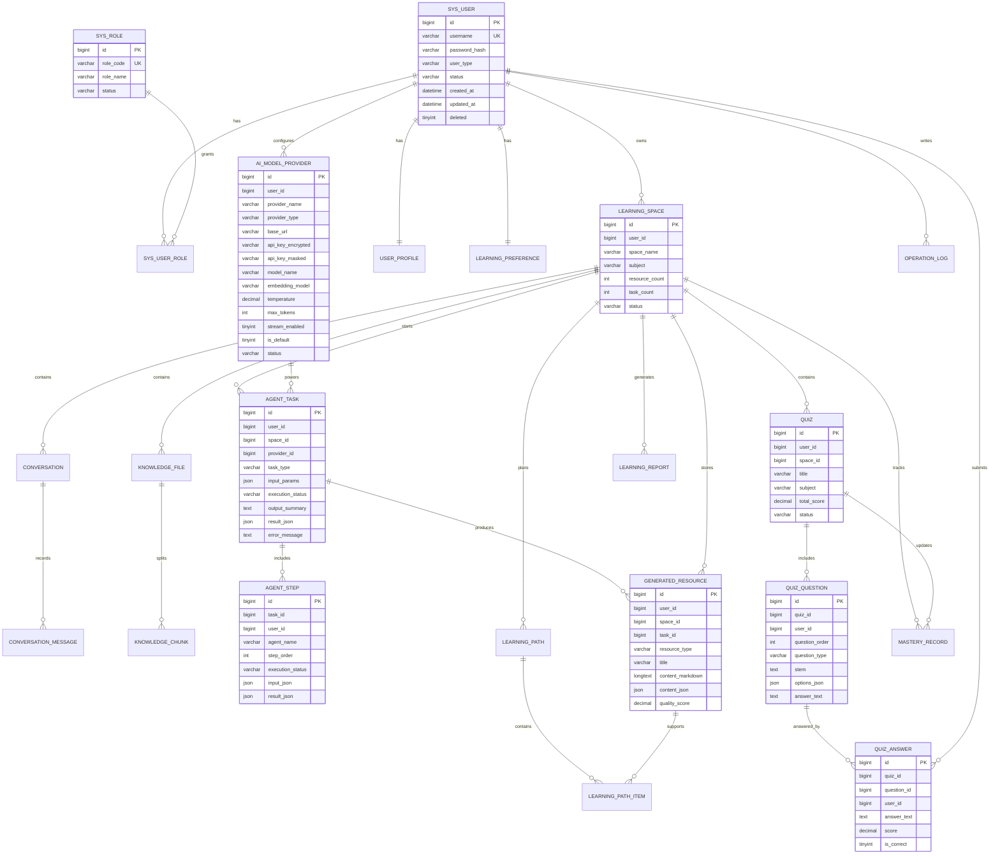

# E-R 关系图

本项目采用“逻辑外键为主、数据库强外键为辅”的策略。下图使用 Mermaid 表示主要业务实体关系，关系字段会在 Java 后端 Service 层进行校验。

## 关系说明

1. 用户是所有个人学习数据的归属主体，核心表都保留 `user_id`。
2. 学习空间是学习活动的上下文，知识库、对话、任务、资源、路径、测验和报告都可以按 `space_id` 归档。
3. 智能体任务通过 `agent_task` 和 `agent_step` 分离总体任务与分步骤执行记录，便于前端展示执行过程。
4. 生成资源可来自智能体任务，也可在后续阶段支持人工创建或重新生成。
5. 测验结果会更新掌握度记录，并用于学习报告。
